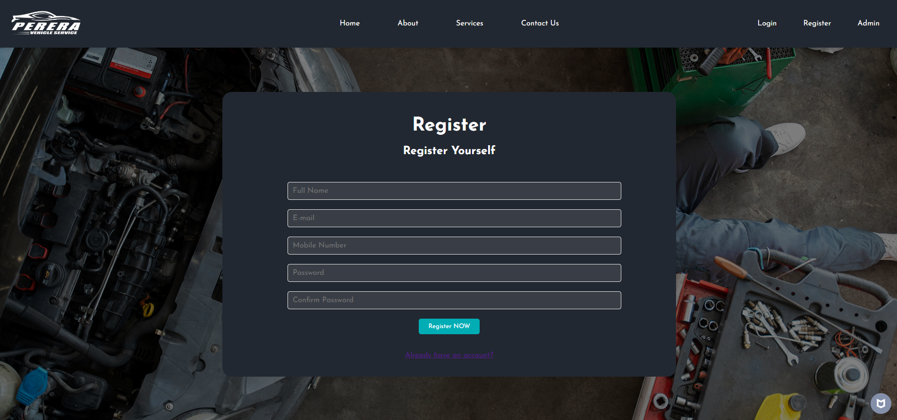
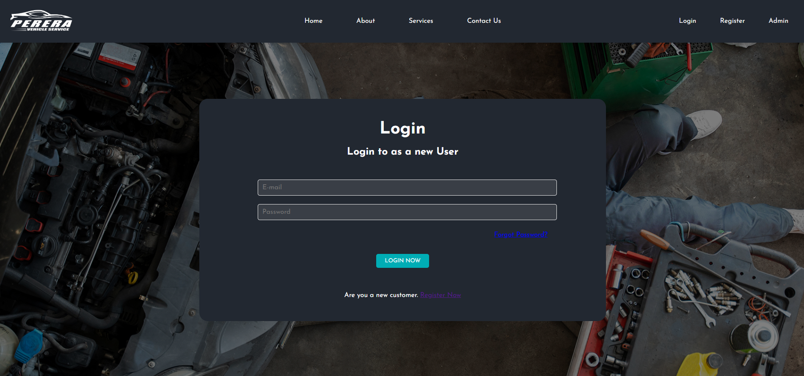
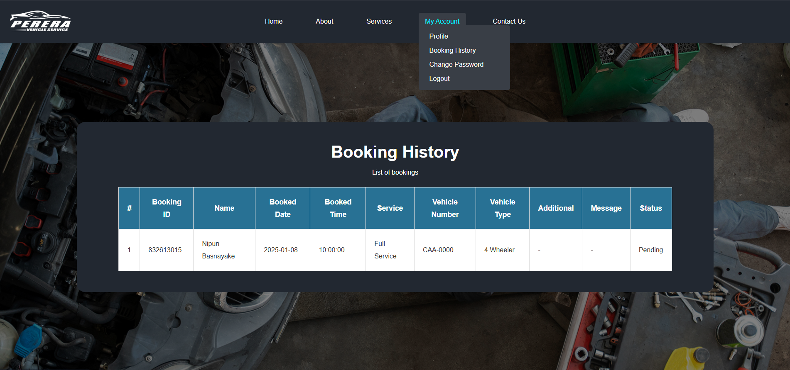
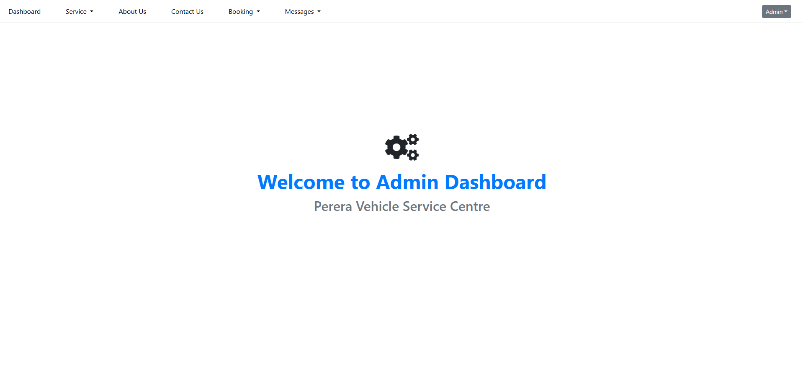

# **Vehicle Service Management System**

## **Overview**
The Vehicle Service Management System (VSMS) is a comprehensive solution designed to automate and streamline vehicle service management. It provides a user-friendly interface for vehicle owners, service centres, and administrators to manage service requests, appointments, vehicle details, service histories, and payments.

---

## **Features**
- **User Registration & Login**:
  - Secure user authentication with login and registration functionality.
  - Differentiated roles for vehicle owners, service centre staff, and administrators.
- **Vehicle Management**:
  - Add, update, and view vehicle details.
  - Track service history and schedule future services.
- **Service Request Management**:
  - Vehicle owners can request services, track service progress, and receive notifications.
  - Service centre staff can manage requests, assign tasks, and update service statuses.
- **Admin Dashboard**:
  - Provides an overview of the system with statistics, service requests, user management, and more.

---

## **Technologies Used**
- **Programming Languages**: PHP, JavaScript, HTML, CSS
- **Frameworks**: Bootstrap (for frontend design)
- **Database**: MySQL for storing vehicle and service data
- **Authentication**: PHP-based session handling for user authentication

---

## **Project Status**
- **In Progress**: The system is being actively developed and improved.

---

## **Usage**

### **User:**
1. **Register/Login**: Users can sign up or log in based on their role (vehicle owner, service centre staff, or admin).
2. **Update User Profile**: Users can update their personal details and account information.
3. **Add Comment/Feedback**: Users can leave comments and feedback on services they have used.
4. **Send a Message to Admin**: Users can send messages or inquiries directly to the admin.
5. **Make Booking for a Service**: Vehicle owners can book a service appointment.
6. **See Bookings History**: Users can view the history of all their previous service bookings.

### **Admin:**
1. **Add/Update/View/Delete Services**: Admin can manage the available services, including adding, updating, viewing, or deleting service options.
2. **Add/Update/View/Delete Website About Us Section**: Admin can update the website's 'About Us' section.
3. **Add/Update/View/Delete Website Contact Us Section**: Admin can modify the website's 'Contact Us' section.
4. **Add/Update/View/Delete Bookings**: The admin can manage bookings by adding, updating, or deleting them, as well as approving or canceling them.
5. **Add/Update/View/Delete Messages Sent by User**: Admin can manage messages sent by users, including adding, updating, viewing, or deleting them.

---

## **Screenshots**

---

## **Contributing**
Contributions are encouraged! If you'd like to help develop this system further, please fork the repository, make your changes, and submit a pull request.

---

## **License**
This project is licensed under the MIT License. For more details, check the LICENSE file.

---

## **Credits**
- **Developer**: Nipun Basnayake
- **Libraries Used**:
  - Bootstrap for frontend development
  - MySQL for database management
  - PHP for backend development

---

## **Contact**
For more details, questions, or contributions, feel free to contact:
- Email: [nipunsathsara1999@gmail.com](mailto:nipunsathsara1999@gmail.com)
- GitHub: [NipunBasnayake](https://github.com/NipunBasnayake)
